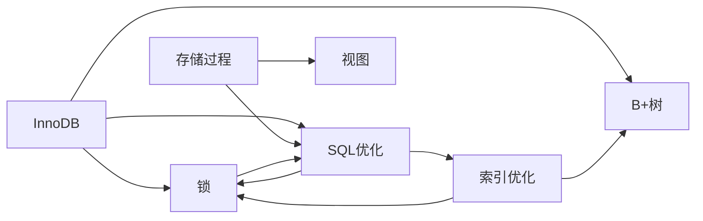

# MySQL 数据库笔记

> 本笔记集涵盖 MySQL 数据库的核心知识，从存储引擎底层原理到 SQL 调优实践。

---

## 存储引擎

- [[InnoDB]] — InnoDB 存储引擎：逻辑存储结构、架构、磁盘结构、后台线程、事务（MVCC、Redo Log、Undo Log）

## 索引与数据结构

- [[为什么使用B+树而不使用其他数据结构]] — B+ 树与 B 树、红黑树、哈希表的对比分析
- [[索引优化]] — 最左前缀法则、覆盖索引、前缀索引、SQL 提示、查询优化原则

## SQL 优化

- [[SQL优化]] — 插入优化、主键优化（页分裂/页合并）、排序优化、Group By / Count / Limit / Update 优化

## 数据库对象

- [[存储过程]] — 存储过程的创建与调用、参数、变量、流程控制、游标
- [[视图]] — 视图的定义、语法、修改条件、With Check Option

## 并发控制

- [[锁]] — 全局锁、表级锁（表锁、元数据锁、意向锁）、行级锁（行锁、间隙锁、临键锁）

---

## 知识关联图

---

## 🧩 关联：课程学习

本库是 MySQL 的**原理归纳**；配套的 [[MySQL数据库（lxj）/01 mysql课程介绍（导航栏）|MySQL 课程]] 提供完整**学习路线**（基础 / 进阶 / 运维三篇）与 SQL 实操，二者互为「课程 ↔ 原理」。

- 学习路线入口：[[MySQL数据库（lxj）/01 mysql课程介绍（导航栏）|MySQL 课程导航]]
- 相关实战：[[仓库管理系统/05_数据库知识/MySQL数据库基础知识汇总|仓库管理系统 - MySQL 数据库知识]]
