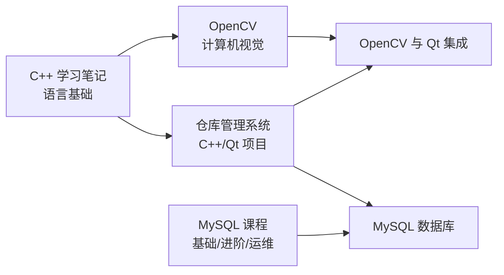

# 🧠 个人知识库总览

> 我的大学软件工程（C++ 方向）学习之旅，笔记主要用 **Obsidian** 记录。
> 本页是**所有知识库的入口**，从「语言基础」出发，串起「课程学习」与「项目实战」。

---

## 🗺️ 知识地图

> **核心关系**：
> - **C++** 是 [[OpenCV学习笔记/_MOC|OpenCV]] 与 [[仓库管理系统/_MOC|仓库管理系统]] 的共同语言基础
> - **OpenCV 与 Qt 集成** 连接了视觉与桌面 UI 两大领域
> - 两套 **MySQL** 笔记互为「课程学习 ↔ 原理归纳」
> - **仓库管理系统** 是 C++/Qt/MySQL 的综合实战项目

---

## 📂 各知识库入口

| 领域 | 定位 | 入口 |
| --- | --- | --- |
| **C++** | 语言基础（语法 + 内存模型） | [[C++学习笔记/_MOC]] |
| **OpenCV** | 计算机视觉（课程 + 主题归纳） | [[OpenCV学习笔记/_MOC]] |
| **仓库管理系统（WMS）** | C++17 / Qt 6 / MySQL 实战项目 | [[仓库管理系统/_MOC]] |
| **MySQL 课程** | 数据库学习路线（基础 / 进阶 / 运维） | [[MySQL数据库（lxj）/01 mysql课程介绍（导航栏）\|MySQL 课程]] |
| **MySQL 知识** | 数据库原理归纳（InnoDB / 索引 / 锁 / 优化） | [[MySQL数据库/MySQL数据库 MOC\|MySQL 知识 MOC]] |

---

## 🔄 跨领域关联（重点）

- **C++ ↔ OpenCV**：`cv::Mat`、`std::vector`、内存管理都建立在 C++ 基础之上
- **C++ ↔ 仓库管理系统**：指针、类、RAII、内存模型在 Qt 项目中大量应用
- **OpenCV ↔ 仓库管理系统**：BGR→RGB 转换、QImage 显示（见 [[OpenCV学习笔记/主题模块/OpenCV与Qt集成]]）
- **MySQL 课程 ↔ MySQL 知识**：课程讲「怎么用」，知识库讲「为什么」（B+ 树、MVCC、锁）
- **仓库管理系统 ↔ MySQL**：项目持久层使用 MySQL，相关知识见 [[仓库管理系统/05_数据库知识/MySQL数据库基础知识汇总]]

---

*仓库主页，随学习进度持续更新。*
