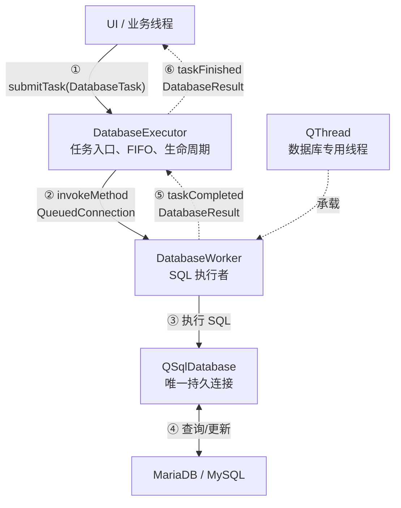
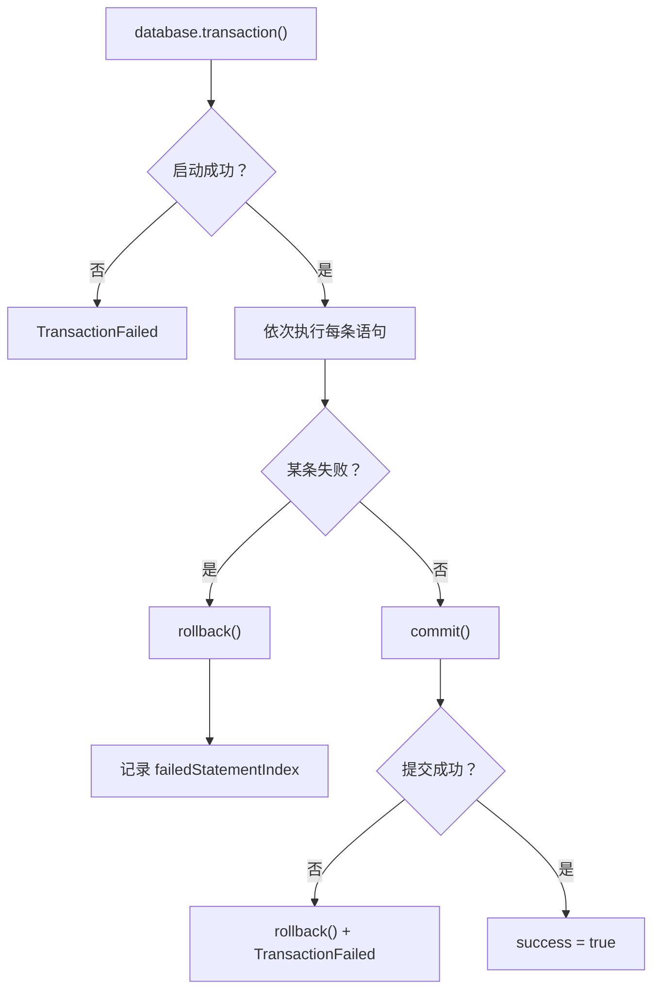
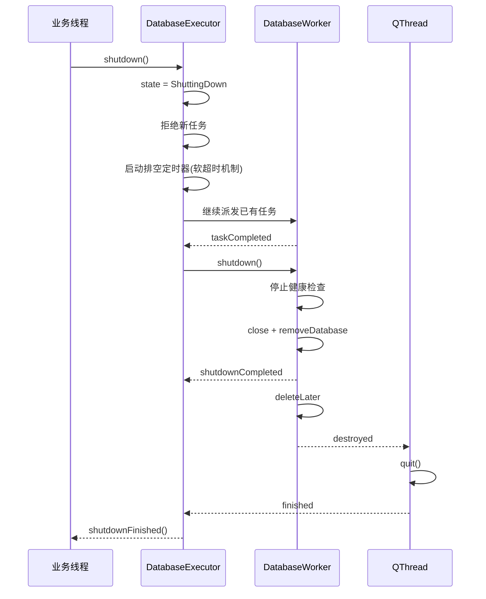

#相关:[[C++_Qt_MySQL_仓库管理系统_学习计划#阶段 2 核心基础设施 (Day 4-6)]]
### 整体架构:

**本质: 单数据库线程+单数据库连接+任务队列+异步结果通知**,用于保障QSqlDatabase的线程亲和性,防止一个QSqlDatabase被多个线程使用
### 三层划分
1. 值类型层 DatabaseTypes
   ***用于定义不同线程之间传递的数据格式***

|    类型    | 定义                              |
| :------: | ------------------------------- |
|  数据库配置   | DatabaseConfig                  |
| 数据库SQL语句 | DatabaseStatement,StatementType |
|  数据库任务   | DatabaseTask,DatabaseTaskType   |
|   执行结果   | DatabaseResult,StatementResult  |
|   错误信息   | DatabaseErrorCode,DatabaseError |
|  执行器的状态  | DatabaseExecutorState           |
2. 调度层DatabaseExecutor
负责:
    1). 创建工作线程
    2). 创建和移动DatabaseWorker
    3). 接收任务并提交任务到DatabaseWorker
    4). 接收任务执行结果
    5). 管理启动,运行,关闭等状态
    6). 处理任务队列  
3. 执行层DatabaseWorker
负责:
	1). 创建数据库连接 
	2). 创建QSqlQuery及其参数绑定和执行
	3). 执行查询和命令及事务
	4). 健康检查
	5). 关闭和移除数据库连接
### 事务的执行流程

### 正常关闭流程
