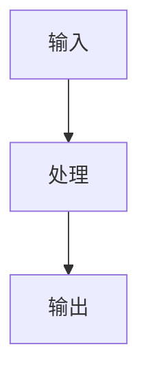

# {{title}}

> 梳理「{{title}}」的核心概念、原理与工程实践要点。

---

## 一、核心概念

（先用一句话给结论，再展开。）

## 二、原理 / 流程


```mermaid
flowchart TB
    A["输入"] --> B["处理"] --> C["输出"]
```

## 三、代码 / 实践

```cpp
// 最小可运行示例
```

## 四、易错点

- 

## 五、相关笔记

- 

---

- **知识库总览**：[[README]]
